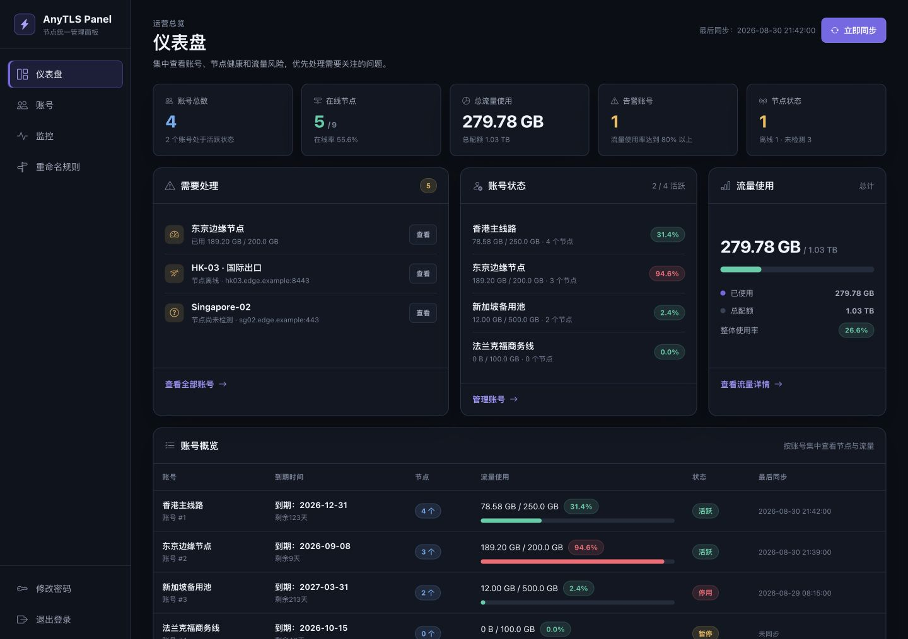
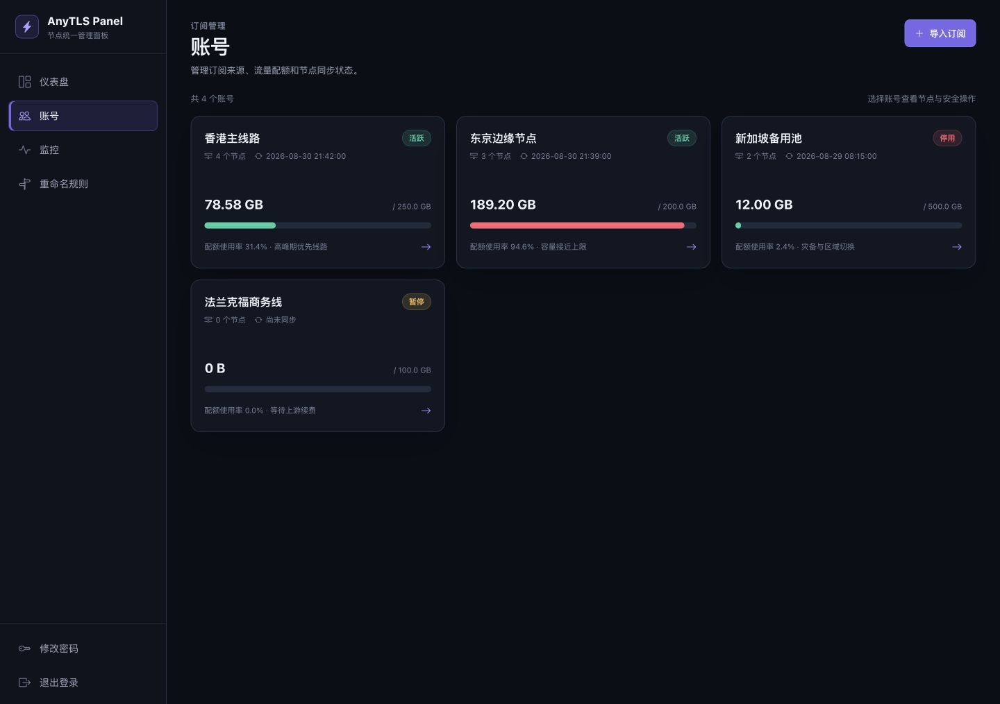
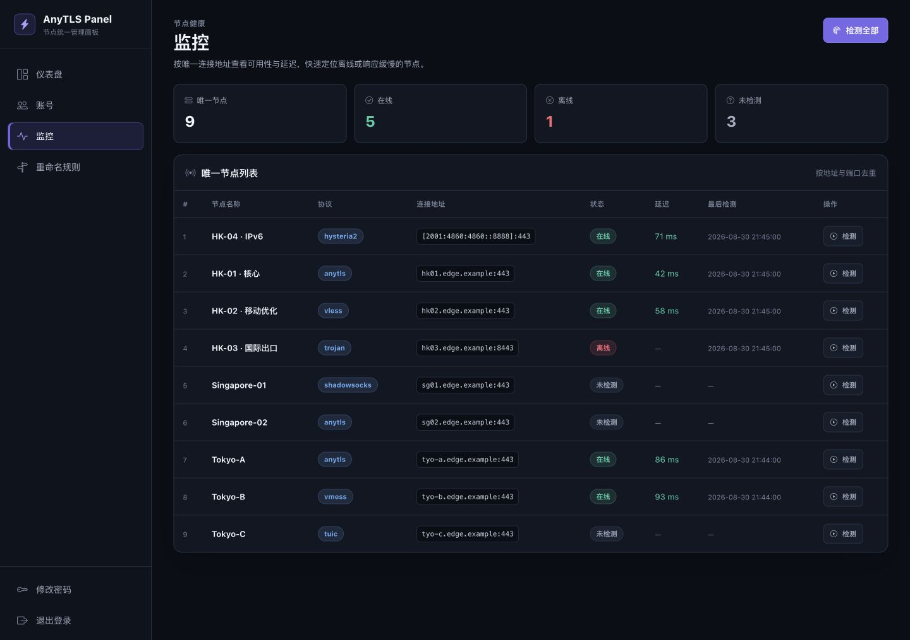
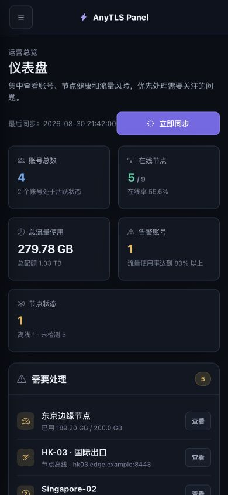

# AnyTLS Panel

[](https://github.com/Elegying/AnyTLS_Panel/actions/workflows/ci.yml)
[](https://github.com/Elegying/AnyTLS_Panel/releases/latest)
[](LICENSE)
[](docs/OPERATIONS.md#支持环境)

一个轻量、安全、可自托管的代理订阅与节点管理面板。它把分散的订阅账号、节点状态、流量配额和分享链接集中到一个清晰的 Web 界面中，适合个人或小团队统一管理。



> 当前正式版本：`v1.4.1`。生产环境请优先部署正式 Release，不要直接运行来源不明或未经审查的分支脚本。

## 你可以用它做什么

| 能力 | 通俗说明 |
| --- | --- |
| 多协议订阅导入 | 支持 AnyTLS、Trojan、VMess、VLESS、Hysteria2、TUIC、Shadowsocks，以及 Clash YAML、Base64 和多行链接 |
| 多账号统一管理 | 一个账号对应一个订阅来源，可独立设置名称、状态、流量上限、备注和到期日 |
| 用户服务与续费 | 为每位下游用户记录服务期、续费历史和提醒状态，并提供始终稳定的独立订阅链接 |
| 月度流量周期 | 账号到期日仍是真实到期日；系统按其中的日号推导每月重置日，例如 `2027-04-24` 表示每月 24 日重置 |
| 一键同步 | 单独同步一个账号，或并发更新全部活跃账号；失败不会覆盖上一次可用节点 |
| 节点健康检测 | 检测节点是否在线并记录延迟，同时限制探测目标，避免访问内网敏感服务 |
| 流量统计 | 显示上传、下载、累计使用量、配额占比和到期状态，可接入节点侧采集脚本 |
| 安全分享 | 为账号生成独立订阅链接，停用账号后链接立即失效，Token 可随时轮换 |
| 生产级运维 | 自动配置 Caddy HTTPS、systemd 沙箱、健康检查、每日数据备份、数据库迁移和失败回滚 |

## 开始之前

生产部署需要：

- 一台全新的或用途明确的 **Ubuntu 24.04 LTS** 服务器；
- 一个已经解析到服务器公网 IP 的域名，例如 `panel.example.com`；
- 云安全组和主机防火墙已放行 TCP `80`、`443`；
- 具备 `root` 权限，并能访问 GitHub、Python 包索引和 Caddy 官方软件源；
- 至少 512 MiB 内存。

如果只是本地体验，请跳到[本地开发](#本地开发)，不要在个人电脑上运行生产部署脚本。

## 5 分钟部署

### 1. 下载并检查固定版本的脚本

```bash
curl -fL \
  https://raw.githubusercontent.com/Elegying/AnyTLS_Panel/v1.4.1/deploy.sh \
  -o /tmp/anytls-panel-deploy.sh
less /tmp/anytls-panel-deploy.sh
```

确认脚本来源和内容后，以 `root` 运行：

```bash
bash /tmp/anytls-panel-deploy.sh
```

脚本会依次询问管理员用户名、管理员密码和面板域名。密码输入不会显示在终端中。

如果你已经审查过脚本，也可以使用一行命令：

```bash
bash <(curl -fsSL https://raw.githubusercontent.com/Elegying/AnyTLS_Panel/v1.4.1/deploy.sh)
```

### 2. 打开面板

部署成功后访问：

```text
https://你的域名/login
```

Caddy 会自动申请受信任的 HTTPS 证书、将 HTTP 跳转到 HTTPS，并在证书到期前自动续签。

### 3. 完成首次设置

1. 使用部署时设置的管理员账号登录；
2. 进入「账号」，点击「导入订阅」；
3. 填写订阅内容、流量上限和备注；
4. 在「监控」中检测节点，在「重命名规则」中统一整理节点名称；
5. 在「用户服务」里登记每位用户的开始日、到期日和所用专线账号，再把该用户的独立订阅链接发给对方。

用户服务即使迁移到另一条专线，订阅链接也不会改变；暂停、到期或重新生成链接后，旧访问会立即失效。仪表盘会集中显示未来 30 天需要续费提醒的用户。

更细的图文式步骤见[快速开始](docs/QUICKSTART.md)。

## 界面预览

| 账号管理 | 节点监控 |
| --- | --- |
|  |  |

移动端同样支持完整的查看和管理操作：



## 文档导航

| 文档 | 适合谁 | 内容 |
| --- | --- | --- |
| [快速开始](docs/QUICKSTART.md) | 第一次使用的人 | 从准备域名到导入第一个订阅 |
| [配置参考](docs/CONFIGURATION.md) | 部署和维护人员 | 所有环境变量、默认值、边界和使用场景 |
| [API 参考](docs/API.md) | 接入脚本的开发者 | 鉴权方式、请求示例、返回值和错误处理 |
| [运维手册](docs/OPERATIONS.md) | 服务器管理员 | HTTPS、备份、更新、回滚、卸载和排障 |
| [架构说明](docs/ARCHITECTURE.md) | 贡献者和维护者 | 模块职责、数据流、安全边界和发布流程 |
| [常见问题](docs/FAQ.md) | 所有用户 | 登录、订阅、证书、监控和流量统计问题 |
| [贡献指南](CONTRIBUTING.md) | 准备提交代码的人 | 开发环境、测试、提交和 Pull Request 规范 |
| [安全策略](SECURITY.md) | 安全研究者 | 支持版本、安全问题报告方式和披露原则 |

也可以从[文档中心](docs/README.md)按任务查找内容。

## 安全设计

AnyTLS Panel 默认采用“拒绝高风险行为，需要时显式放开”的策略：

- 订阅默认只允许 HTTPS，并拒绝回环、内网、链路本地和保留地址；
- 节点检测默认只连接 DNS 解析出的公网地址；
- 浏览器管理操作使用登录会话和 CSRF 防护；流量上报使用独立 Bearer Token；
- 密码使用带随机盐的 PBKDF2-SHA256，登录限流跨进程和重启生效；
- Session 使用 Secure、HttpOnly、SameSite，并有固定有效期和主动撤销机制；
- 响应启用严格 CSP、HSTS、点击劫持防护和请求 ID；
- 生产进程使用低权限用户和 systemd 沙箱，只能写入数据目录；
- 更新前会验证依赖和数据库副本，切换失败自动恢复旧版本；
- 健康检查同时验证应用、数据库、HTTPS 和证书有效期。

涉及公网暴露前，请先阅读[安全策略](SECURITY.md)和[生产运维手册](docs/OPERATIONS.md)。本项目不会替代防火墙、异机备份、主机补丁和组织自身的访问控制。

## 常用管理命令

```bash
# 服务状态
systemctl status anytls-panel caddy

# 应用日志
journalctl -u anytls-panel -n 100 --no-pager

# 健康检查记录
journalctl -u anytls-panel-healthcheck.service -n 30 --no-pager

# 列出自动保留的可回滚版本
/opt/anytls-panel/deploy.sh --list-backups

# 创建并验证每日灾难恢复备份
sudo /opt/anytls-panel/backup.sh
sudo /opt/anytls-panel/backup.sh --verify latest

# 回滚到最近一份可用备份
/opt/anytls-panel/deploy.sh --rollback latest
```

更新、数据库备份、恢复演练和卸载步骤请直接参考[运维手册](docs/OPERATIONS.md)，不要凭经验删除 `/opt/anytls-panel`。

## 本地开发

```bash
git clone https://github.com/Elegying/AnyTLS_Panel.git
cd AnyTLS_Panel
python3 -m venv .venv
. .venv/bin/activate
python -m pip install --require-hashes -r requirements-dev.txt
python -m unittest discover -s tests -q
./start.sh
```

默认地址为 `http://127.0.0.1:8866`。首次启动生成的管理员密码保存在数据库旁的 `.initial_admin_password` 文件中。`start.sh` 只用于本地开发；生产环境必须使用 `deploy.sh`、Gunicorn、systemd 和 Caddy。

常用质量检查可以统一运行：

```bash
make check
```

## 项目结构

```text
AnyTLS_Panel/
├── app.py                    # Flask 应用、页面路由和 API
├── db_migrations.py          # SQLite 版本化迁移
├── database_maintenance.py   # 数据保留与维护检查
├── protocol_codecs.py        # 多协议解析和格式转换
├── node_probe.py             # 带网络边界校验的节点探测
├── templates/                # 服务端 HTML 模板
├── static/                   # 样式、图标与字体
├── docs/                     # 用户、配置、API、架构和运维文档
├── tests/                    # 单元测试与 Ubuntu 部署集成测试
├── deploy.sh                 # 生产部署、更新和回滚入口
├── traffic_collector.sh      # 节点侧 IPv4 端口流量采集器
└── release-files.txt         # 生产发布文件白名单
```

更详细的模块和数据流说明见[架构说明](docs/ARCHITECTURE.md)。

## 支持范围与限制

- 当前唯一经过端到端验证的生产系统是 Ubuntu 24.04 LTS；
- `traffic_collector.sh` 基于 iptables，只统计 IPv4 且按端口计数；共享端口或 IPv6 场景需要其他用户级指标；
- AnyTLS Panel 是管理面板，不提供代理服务端本身，也不会自动创建节点；
- 公开订阅链接相当于访问凭据，应通过 HTTPS 传输并按需轮换；
- 对 Debian、旧版 Ubuntu、RHEL、容器平台和多机高可用目前不作生产兼容承诺。

完整边界见[支持说明](SUPPORT.md)。

## 参与贡献

欢迎提交问题、改进文档或贡献代码。开始之前请阅读[贡献指南](CONTRIBUTING.md)和[社区行为准则](CODE_OF_CONDUCT.md)。安全漏洞不要发布到公开 Issue，应按[安全策略](SECURITY.md)私下报告。

## 合规使用

请仅在你有权管理的服务器、订阅和网络环境中使用本项目，并遵守所在地法律、服务条款和组织安全要求。项目维护者不对未经授权的访问、滥用或由错误配置造成的损失负责。

## 开源协议

本项目采用 [MIT License](LICENSE)。项目内置的 Bootstrap Icons 资源遵循其随附的 [MIT 许可证](static/vendor/LICENSE.bootstrap-icons)。
